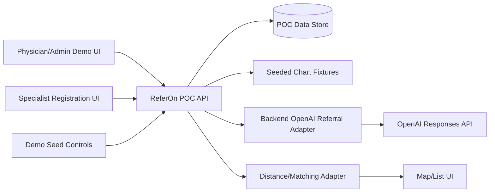
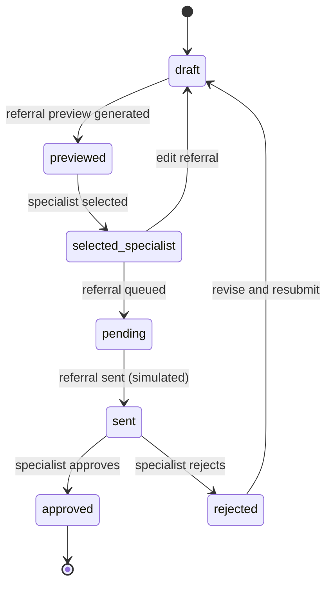
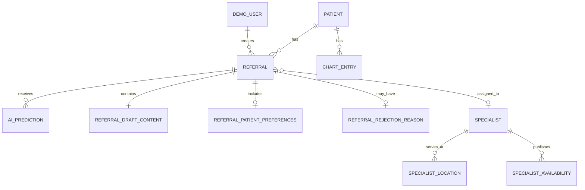

# ReferOn Master Document

Version: 0.3  
Status: Draft  
Last updated: 2026-06-20  
Owner: ReferOn product and engineering

## 1. Purpose

ReferOn is a proof-of-concept web application for creating medical referrals from a patient's latest medical chart history. The POC demonstrates how AI can reduce referral preparation effort, suggest the likely specialty required, and help route the referral to a nearby available specialist.

The POC is designed for hackathon demonstration to non-technical investors, physicians, and faculty. It is not production clinical software. It uses synthetic or de-identified demonstration data, and it does not diagnose, independently order care, or replace physician judgment.

## 2. Product Goals

- Reduce administrative effort required to create complete specialist referrals.
- Use recent chart history to suggest the most relevant specialist type.
- Show a physician/admin-facing manual trigger for referral creation.
- Show a simple specialist self-registration flow.
- Match referrals to nearby specialists using specialty and subspecialty fit (including accepted case types and procedures), geography, availability, and physician-entered patient preferences.
- Tell a clear demo story: chart review to AI suggestion to referral draft to matched specialist.

## 3. POC Strategy

### 3.1 POC Hypothesis

Physicians and clinic administrators lose time converting chart history into specialist referrals and finding appropriate specialists. A focused referral assistant can make that workflow visibly faster and more complete, creating business value even before deep EMR integration, identity management, and production security hardening exist.

### 3.2 Demo Narrative

1. A physician opens a preloaded patient chart.
2. The physician clicks a manual "Create Referral" trigger.
3. ReferOn summarizes the latest relevant chart history.
4. AI predicts the likely specialty and explains why.
5. ReferOn drafts a referral letter/package.
6. The family physician enters patient referral preferences.
7. ReferOn displays and proposes nearby available specialists on a map list using those preferences.
8. The physician selects a specialist and sees a ready-to-send referral preview.
9. The referral moves through simulated pending, sent, approved, or rejected status; rejections include a reason fed back to AI for future referrals.

### 3.3 POC Success Criteria

- Viewers understand the business pain within the first minute.
- The demo shows a referral draft created from chart history in under 30 seconds.
- The AI specialty recommendation is explainable with references to chart snippets.
- The specialist match view makes geography and availability obvious.
- Specialist self-registration is simple enough to demonstrate live.
- The team can clearly explain what is real, mocked, and planned next.

## 4. Scope

### 4.1 In Scope for POC

- Preloaded synthetic or de-identified patient chart fixtures.
- Referral draft generation using latest chart history.
- AI-assisted specialty prediction with confidence (within reason), rationale, and source references.
- Manual referral trigger for the demo clinician/admin persona.
- Referral preview and lightweight edit flow.
- Family physician capture of patient referral preferences.
- Specialist self-registration and profile management.
- Specialist location capture and nearest-neighbor search.
- Specialty- and case-type-aware specialist matching with availability.
- Map/list visualization of candidate specialists.
- Simulated referral lifecycle statuses including pending, sent, approved, and rejected.
- Rejection reason capture and AI feedback loop for future referrals.
- API-first structure where useful, without overbuilding production infrastructure.

### 4.2 Explicitly Deferred

- User identity, login, RBAC, and permission management.
- Production-grade security and compliance controls.
- Immutable audit logging.
- Real EMR integration.
- Real patient data.
- Real referral submission to clinics.
- Direct diagnosis generation.
- Fully autonomous referral submission without human review.
- Billing, claims, or payment workflows.
- Patient-facing appointment booking.

### 4.3 Future Production Scope

- User authentication, organization accounts, RBAC, and invitation flows.
- PHI-grade security, privacy, consent, retention, and audit controls.
- EMR integration and document ingestion from real clinical sources.
- Referral submission channels such as fax, secure email, or direct API.
- Specialist credential verification workflows.
- Production observability, deployment, backups, and incident response.

## 5. Demo Personas

These are demo personas, not production security roles.

| Persona | Description | Demo Capabilities |
| --- | --- | --- |
| Physician | Clinician evaluating a patient chart | Trigger AI referral, enter patient preferences, review draft, choose specialist |
| Clinic Admin | Office staff preparing referrals | Start manual referral and prepare package preview |
| Specialist | External specialist or clinic representative | Self-register, publish availability/location, approve or reject referrals with reason |
| Demo Operator | Person presenting the POC | Switch between demo views and reset seed data |

## 6. Core Workflows

### 6.1 AI-Assisted Referral Creation

1. Demo user selects a seeded patient.
2. User triggers "Create referral from latest chart."
3. System reads the patient's latest relevant seeded chart history.
4. AI service predicts the required specialty and produces:
   - predicted specialty,
   - confidence score,
   - rationale,
   - source chart references,
   - missing information warnings.
5. System drafts a referral package.
6. User reviews and optionally edits the draft.
7. Family physician enters patient referral preferences.
8. User selects a specialist from ranked matches informed by those preferences.
9. System displays a ready-to-send referral preview.
10. Referral progresses through pending, sent, approved, or rejected status; if rejected, the system captures the rejection reason for AI feedback on future referrals.

### 6.2 Manual Referral Trigger

1. Demo user starts a referral manually.
2. User selects patient, reason for referral, preferred specialty, urgency, notes, and patient referral preferences.
3. System may optionally enrich the draft from chart history.
4. Matching proceeds through the same specialist ranking view using entered preferences.

### 6.3 Specialist Self-Registration

1. Specialist opens registration page.
2. Specialist submits name, clinic, specialty, location, contact, accepted case types, referral types, and specific procedures or surgeries, and availability.
3. System creates a demo specialist profile.
4. Profile becomes visible in the demo matching directory.

### 6.4 Patient Referral Preferences (Physician-Entered)

1. Family physician enters patient referral preferences during referral creation or draft review.
2. Preferences may include:
   - maximum travel distance or preferred geography,
   - preferred or favorite specialists,
   - excluded specialists,
   - language or communication preferences where relevant,
   - timing or urgency constraints beyond clinical urgency,
   - other notes reflecting what the patient wants in a referral.
3. System stores preferences on the referral record.
4. Preferences route into specialist matching and selection.

### 6.5 Specialist Matching

1. System receives referral specialty, patient location, urgency, constraints, and physician-entered patient preferences.
2. System filters specialists by:
   - specialty and subspecialty,
   - accepted case types, referral types, and specific procedures or surgeries,
   - accepting-new-referrals flag,
   - availability window,
   - physician-entered patient preferences such as max distance, excluded specialists, and preferred specialists.
3. System ranks candidates by:
   - distance from patient,
   - next available appointment or intake capacity,
   - specialty fit (including case type and procedure match),
   - alignment with physician-entered patient preferences.
4. Physician selects a specialist from ranked matches informed by patient preferences.

### 6.6 Referral Status and Rejection Feedback

1. After specialist selection and preview, referral status moves to pending, then sent (simulated in the POC).
2. Specialist or demo operator marks the referral as approved or rejected.
3. If rejected, the user must enter a rejection reason.
4. System stores the rejection reason on the referral record.
5. Rejection reasons are supplied to the AI service as feedback to improve future referral drafting, specialty prediction, and specialist matching.

## 7. Functional Requirements

### 7.1 Patient and Chart History

- FR-001: The POC shall include seeded synthetic or de-identified patient profiles.
- FR-002: The POC shall include seeded chart history for each demo patient.
- FR-003: The system shall identify the latest clinically relevant chart entries for referral generation.
- FR-004: The system shall preserve references from generated referral content back to source chart entries.
- FR-005: The system shall show warnings when chart data is stale, incomplete, or unavailable.

### 7.2 Referral Drafting

- FR-010: The system shall create a referral draft from patient chart history.
- FR-011: The system shall allow demo users to create a referral manually.
- FR-012: The system shall support referral fields including reason, specialty, urgency, history, medications, allergies, investigations, attachments, notes, and physician-entered patient preferences.
- FR-013: The system shall allow users to edit drafts before preview.
- FR-014: The POC shall show a ready-to-send preview; sent, approved, and rejected statuses are simulated and do not submit real referrals.
- FR-015: The system shall maintain referral status values: draft, previewed, selected_specialist, pending, sent, approved, and rejected.
- FR-016: When a referral status is rejected, the system shall require and store a rejection reason.
- FR-017: The system shall supply stored rejection reasons to the AI service as feedback to improve future referral drafting, specialty prediction, and specialist matching.
- FR-018: The system shall allow the family physician to enter patient referral preferences during referral creation or draft review.
- FR-019: The system shall store physician-entered patient preferences on the referral.
- FR-020: The system shall apply patient preferences to specialist filtering, ranking, and selection.

### 7.3 AI Specialty Prediction

- FR-021: The system shall predict the most likely required specialty from chart history.
- FR-022: The system shall return confidence and rationale with each AI prediction.
- FR-023: The system shall expose chart references used by AI-generated suggestions.
- FR-024: The system shall allow users to override AI-predicted specialty.
- FR-025: The POC shall display enough AI provenance for the demo, including source snippets and model/prompt label where practical.
- FR-026: The system shall avoid presenting AI output as diagnosis or final clinical decision.

### 7.4 Specialist Registry

- FR-030: The system shall allow specialists to self-register.
- FR-031: The POC shall immediately show registered specialists in the demo directory.
- FR-032: The system shall capture specialty, subspecialty, clinic name, service locations, contact methods, accepted case types, referral types, and specific procedures or surgeries, and availability.
- FR-033: The system shall allow specialists to update availability and accepting-referrals status.
- FR-034: The POC shall label specialist verification as a future production workflow.

### 7.5 Geographic Matching

- FR-040: The system shall store specialist service locations as latitude/longitude coordinates.
- FR-041: The POC may use pre-seeded coordinates instead of live geocoding.
- FR-042: The system shall support nearest-neighbor search by distance from patient location.
- FR-043: The system shall rank available specialists using distance, availability, and physician-entered patient preferences.
- FR-044: The system shall show distance, next availability, and preference alignment in referral matching results.

### 7.6 Demo Experience

- FR-050: The POC shall include a guided demo flow that can be completed reliably.
- FR-051: The POC shall include resettable seed data.
- FR-052: The POC shall visually distinguish generated referral content, AI rationale, and specialist matching results.
- FR-053: The POC shall include clear future-state labels for production-only capabilities.

## 8. Non-Functional Requirements

### 8.1 POC Data Boundaries

- NFR-001: The POC shall use synthetic or de-identified data only.
- NFR-002: Demo data shall be easy to reset.
- NFR-003: The POC shall avoid collecting real patient or specialist personal information during public demos.
- NFR-004: Any live AI call shall avoid sending real PHI.

### 8.2 Reliability

- NFR-010: Referral creation shall fail safely when chart retrieval or AI prediction is unavailable.
- NFR-011: Users shall be able to create manual referrals without AI service availability.
- NFR-012: The demo shall include fallback seeded AI results or graceful error messaging.
- NFR-013: The demo flow shall run locally or in a simple hosted environment without complex operations.

### 8.3 Performance

- NFR-020: Patient search should return results within 500 ms for common queries under normal load.
- NFR-021: Specialist matching should return ranked results within 1 second for POC data volumes.
- NFR-022: AI-assisted draft generation should complete within 30 seconds or present progress and retry affordances.

### 8.4 Maintainability

- NFR-030: The codebase shall keep demo fixtures separate from application logic.
- NFR-031: The system shall use automated tests for the highest-value demo logic where practical.
- NFR-032: The architecture should leave room for future authentication, audit logging, and real integrations.

## 9. System Architecture

### 9.1 Proposed POC Components

- Web frontend: Clinician/admin demo view, specialist registration view, and specialist map/list.
- API backend: Lightweight JSON API for patient, referral, specialist, and matching workflows.
- Data store: Simple relational database, embedded database, or JSON fixtures depending on selected stack.
- Backend OpenAI adapter: Boundary around the Responses API call, prompt template, structured JSON schema, response validation, timeout, and fallback behavior.
- Chart fixture provider: Supplies seeded patient histories.
- Distance adapter: Computes distance from pre-seeded coordinates.

### 9.2 Architecture Diagram



### 9.3 POC Referral State Diagram



## 10. Data Model Draft

### 10.1 Core POC Entities

| Entity | Purpose |
| --- | --- |
| DemoUser | Selected demo persona, not authenticated identity |
| Patient | Seeded patient demographics and location metadata |
| ChartEntry | Seeded chart history unit |
| Referral | Referral draft, preview, and lifecycle status |
| ReferralPatientPreferences | Physician-entered patient preferences used for matching |
| ReferralRejectionReason | Rejection reason and metadata when a referral is rejected |
| ReferralDraftContent | Generated and edited referral content |
| AIPrediction | Specialty prediction, confidence, rationale, model metadata |
| Specialist | Seeded or self-registered demo specialist profile |
| SpecialistLocation | Clinic/service location coordinates |
| SpecialistAvailability | Intake capacity and availability windows |

### 10.2 Entity Relationship Sketch



## 11. API Definitions

The first implementation should treat these as draft contracts. Exact request/response schemas should be promoted into an OpenAPI spec once the backend framework is selected.

### 11.1 Patients and Charts

| Method | Path | Description |
| --- | --- | --- |
| GET | `/api/v1/patients` | Search patients |
| GET | `/api/v1/patients/{patientId}` | Get patient summary |
| GET | `/api/v1/patients/{patientId}/chart-entries` | Get chart history |
| POST | `/api/v1/demo/reset` | Reset seeded demo data |

### 11.2 Referrals

| Method | Path | Description |
| --- | --- | --- |
| GET | `/api/v1/referrals` | List referrals |
| POST | `/api/v1/referrals` | Create manual referral draft |
| POST | `/api/v1/referrals/from-chart` | Create AI-assisted referral draft |
| GET | `/api/v1/referrals/{referralId}` | Get referral details |
| PATCH | `/api/v1/referrals/{referralId}` | Update referral draft and patient preferences |
| POST | `/api/v1/referrals/{referralId}/predict-specialty` | Re-run specialty prediction |
| POST | `/api/v1/referrals/{referralId}/preview` | Generate ready-to-send preview |
| POST | `/api/v1/referrals/{referralId}/select-specialist` | Attach selected specialist |
| POST | `/api/v1/referrals/{referralId}/send` | Mark referral as sent (simulated) |
| POST | `/api/v1/referrals/{referralId}/approve` | Mark referral as approved |
| POST | `/api/v1/referrals/{referralId}/reject` | Mark referral as rejected with reason |

### 11.3 Specialist Registry and Matching

| Method | Path | Description |
| --- | --- | --- |
| POST | `/api/v1/specialists/register` | Specialist self-registration |
| GET | `/api/v1/specialists` | Search specialists |
| GET | `/api/v1/specialists/{specialistId}` | Get specialist profile |
| PATCH | `/api/v1/specialists/{specialistId}` | Update specialist profile |
| GET | `/api/v1/referrals/{referralId}/specialist-matches` | Get ranked specialist matches |

### 11.4 Example: AI-Assisted Referral Request

```json
{
  "patientId": "pat_123",
  "demoPersona": "physician",
  "chartWindowDays": 180,
  "urgency": "routine",
  "additionalInstructions": "Consider recent knee imaging and persistent pain notes."
}
```

### 11.5 Example: AI-Assisted Referral Response

```json
{
  "referralId": "ref_789",
  "status": "draft",
  "predictedSpecialty": {
    "specialty": "Orthopedic Surgery",
    "confidence": 0.82,
    "rationale": "Recent chart entries mention persistent knee pain, failed conservative management, and abnormal imaging.",
    "sourceChartEntryIds": ["chart_001", "chart_002"]
  },
  "warnings": [
    "Medication list has not been updated in over 90 days."
  ]
}
```

### 11.6 Example: Reject Referral Request

```json
{
  "reason": "Missing recent imaging report required for orthopedic intake."
}
```

## 12. AI Design Notes

### 12.1 AI Responsibilities

- Classify likely specialty or subspecialty.
- Draft referral summary sections from cited chart entries.
- Identify missing information that may block referral acceptance.
- Suggest urgency only as decision support with explicit review requirement.
- Incorporate stored rejection reasons as feedback when drafting or matching future referrals for the same patient or similar cases.

### 12.2 POC Guardrails

- Require source references for clinical claims.
- Refuse unsupported clinical assertions.
- Keep generated text editable and visibly marked as AI-assisted until reviewed.
- Use synthetic or de-identified chart content only.
- Include confidence thresholds for review emphasis:
  - high: 0.80 and above,
  - medium: 0.50 to 0.79,
  - low: below 0.50 requiring manual specialty selection.

### 12.3 Evaluation

- Build a small synthetic or de-identified test set of referral scenarios.
- Track top-1 and top-3 specialty accuracy.
- Track unsafe or unsupported generated statements.
- Track whether prior rejection reasons reduce repeat rejections on similar cases.
- Review model performance by specialty class to detect blind spots.

### 12.4 Backend OpenAI Adapter

- The backend owns the OpenAI API call; the frontend never calls OpenAI directly.
- `POST /api/v1/referrals/from-chart` builds a prompt from Synthea-derived chart entries and prior rejection feedback.
- One OpenAI Responses API call returns specialty prediction, rationale, source chart entry IDs, warnings, and draft referral sections.
- The response is requested as strict structured JSON and validated by the backend before persistence.
- Runtime configuration is provided by `OPENAI_API_KEY`, `OPENAI_REFERRAL_MODEL`, `OPENAI_BASE_URL`, and `AI_TIMEOUT_MS`.
- If OpenAI is unavailable or validation fails, the backend uses seeded demo fallback predictions.

## 13. Future Security and Privacy Model

Security, privacy, and identity are intentionally deferred from the hackathon POC so the team can demonstrate business value first. They remain mandatory for any pilot or production use.

Future implementation must include:

- Authentication through an established identity provider.
- Organization accounts and role-based access control.
- Patient-context authorization checks.
- Append-only audit logs for clinical actions.
- PHI redaction from application logs.
- Managed secret storage.
- AI provider configuration that prevents patient data retention for provider training unless explicitly permitted.
- MFA for production internal users.
- Data retention, consent, and privacy policy controls.

## 14. Test Methodology

### 14.1 POC Test Pyramid

- Unit tests for matching logic, referral state transitions, rejection reason capture, and AI adapter parsing.
- Integration tests for API endpoints, demo data persistence, seeded chart retrieval, and geospatial search.
- Contract tests for AI adapter response schema and distance/matching responses.
- End-to-end tests for the demo path: patient selection, referral creation, AI prediction, specialist registration, and matching.

### 14.2 Clinical Safety Testing

- Golden-case referral scenarios with expected specialty outputs.
- Adversarial chart entries with ambiguous or conflicting symptoms.
- Missing-data scenarios where the system must warn instead of overconfidently generating.
- Human review checklist for AI-generated referral drafts.

### 14.3 Acceptance Criteria for POC

- A demo physician can create a referral draft from seeded chart history.
- A demo admin can manually create a referral draft.
- A family physician can enter patient referral preferences that affect specialist matching.
- AI prediction returns specialty, confidence, rationale, and source references.
- A specialist can self-register and appear in the demo directory.
- Specialists can be ranked by specialty fit, distance, and availability.
- The referral preview is compelling enough to show business value.
- Referral status can progress through pending, sent, approved, and rejected (simulated).
- Rejection requires a reason, and that reason is available to the AI feedback loop.
- Manual workflow remains usable when AI service is unavailable or mocked.

## 15. Initial Implementation Plan

### Phase 0: POC Foundations

- Choose application stack.
- Add lightweight API contract.
- Establish seeded demo data model.
- Create seed data for patients, chart entries, and specialists.
- Build demo reset flow.

### Phase 1: Referral Drafting Demo

- Build patient search and chart summary.
- Build manual referral creation.
- Build family physician patient preference capture.
- Build AI-assisted draft creation.
- Build referral preview.
- Build simulated referral status transitions and rejection reason capture.

### Phase 2: AI Assistance and Explainability

- Implement AI adapter boundary.
- Add specialty prediction endpoint.
- Add chart reference display.
- Add manual override flow.
- Wire rejection reasons into AI adapter feedback for future referrals.

### Phase 3: Specialist Registry and Matching Demo

- Build specialist self-registration.
- Add seeded specialist locations.
- Implement nearest-neighbor matching.
- Add availability-aware ranking.
- Add map/list presentation.

### Phase 4: Demo Polish

- Tighten the board-facing user flow.
- Add empty/error/loading states.
- Add a small evaluation set for demo cases.
- Add a future roadmap view or slide-friendly summary.

## 16. Open Questions

- What story should the demo optimize for: investor pitch, physician workflow, or faculty evaluation?
- Which 2-3 patient scenarios best show the value?
- Should the AI call be live, mocked, or hybrid for demo reliability?
- What geography should the specialist map use?
- What specialist taxonomy should be canonical?
- What distance metric should be used initially: straight-line distance, driving distance, or travel time?
- Should availability be self-reported, integrated from calendars, or manually managed?
- Which production controls should be shown as future roadmap items in the UI?

## 17. Decision Log

| Date | Decision | Rationale |
| --- | --- | --- |
| 2026-06-18 | Use document-driven development with this master document as the initial source of truth. | Align product, architecture, APIs, and tests before implementation starts. |
| 2026-06-18 | Treat AI as clinician-facing decision support, not autonomous clinical decision-making. | Preserve clinical accountability and reduce safety risk. |
| 2026-06-18 | Scope the first build as a hackathon POC rather than production MVP. | Focus the demo on business value and product clarity. |
| 2026-06-18 | Defer user identity, RBAC, production security, and audit logging. | These are critical for production but would distract from the first proof of value. |
| 2026-06-18 | Use seeded synthetic or de-identified chart data for the POC. | Avoid privacy risk while keeping the demo realistic. |
| 2026-06-20 | Implement AI referral generation inside the backend with OpenAI structured JSON output. | Keep API keys server-side and return a backend-validated response the client can render predictably. |

## 18. Document Maintenance Rules

- Update this document when requirements, API contracts, architecture, data model, or test methodology materially change.
- Add ADRs for decisions that are too detailed or contentious for the decision log.
- Keep diagrams current with implemented architecture.
- Link implementation tickets or pull requests back to relevant sections when possible.
- Prefer small, reviewed updates over large stale rewrites.
